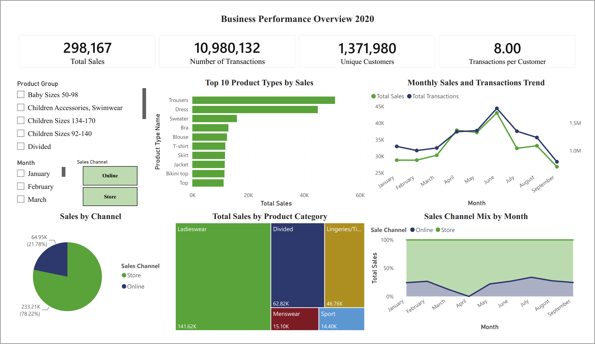
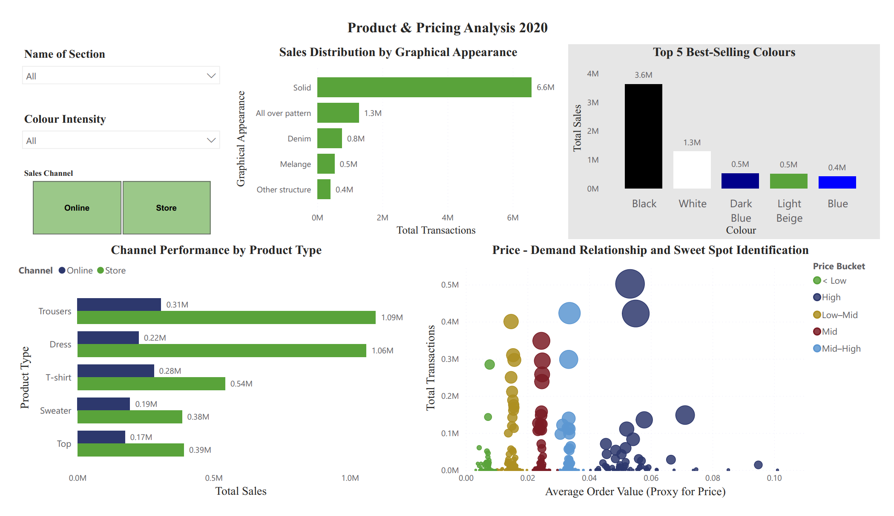
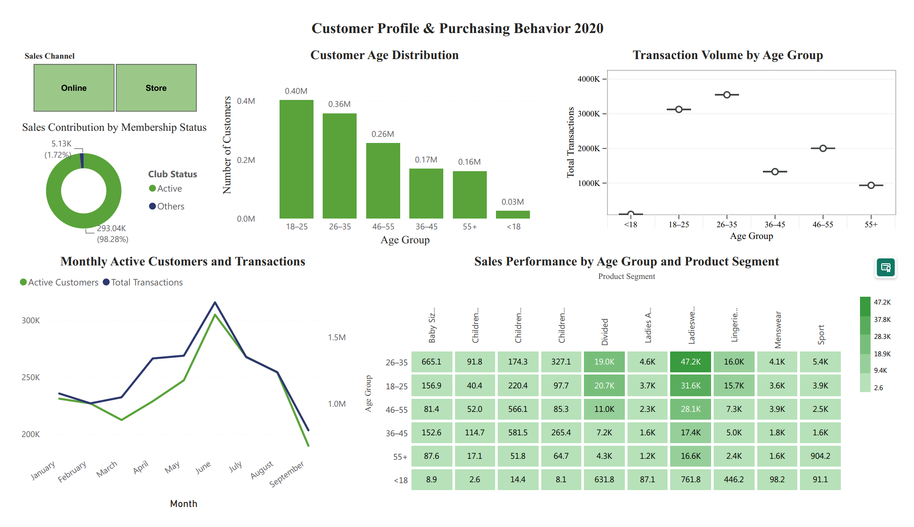

# Retail Sales Analytics Dashboard using Power BI

## Overview

This project presents an interactive business intelligence dashboard built with **Power BI** to analyze retail sales performance, customer behavior, product trends, and pricing strategies using the H&M Fashion Retail dataset.

The objective is to transform a large-scale transactional dataset into meaningful business insights through data modeling, visualization, and interactive reporting.

---

## Objectives

* Analyze sales performance throughout 2020.
* Compare online and in-store sales channels.
* Identify best-selling products, colors, and product categories.
* Explore customer demographics and purchasing behavior.
* Investigate the relationship between pricing and sales performance.
* Build an interactive dashboard to support business decision-making.

---

## Dataset

**Source:** H&M Personalized Fashion Recommendations Dataset

The project utilizes three relational datasets:

* **Transactions:** 31.7 million retail transactions
* **Customers:** 1.37 million customer records
* **Articles:** 105,542 product records

Due to the large size of the original dataset and repository limitations, the raw data and original Power BI project file are not included in this repository.

---

## Technologies

* Power BI Desktop
* Power Query
* DAX
* Data Modeling (Star Schema)
* Data Cleaning & Transformation
* Interactive Dashboard Design

---

## Dashboard Features

### Business Performance Overview

* Sales KPIs
* Monthly sales trends
* Transaction analysis
* Sales channel comparison
* Product category performance

### Product & Pricing Analysis

* Product popularity
* Color and graphical appearance analysis
* Channel performance by product type
* Price vs. Sales relationship
* Price sweet spot identification

### Customer Analytics

* Customer age distribution
* Membership status analysis
* Purchasing behavior
* Revenue contribution by customer segment
* Customer activity trends

---

## Key Insights

* Physical stores generated the majority of total sales throughout 2020.
* Black and White products were the best-selling colors.
* Trousers and Dresses were the highest-performing product categories.
* Customers aged 26–35 generated the highest transaction volume and revenue.
* Medium to medium-high price ranges achieved the best balance between demand and revenue.

---

## Repository Structure

```text
Retail-Sales-Analytics/
│
├── README.md
├── report.pdf
├── dashboard/
│   ├── overview.png
│   ├── products.png
│   └── customers.png
└── data_samples/
```

---

## Limitations

The original dataset contains over **31 million transactions**, making the Power BI project file and dataset too large for GitHub storage.

This repository includes:

* Project documentation
* Dashboard screenshots
* Sample data (optional)

The full dataset is available from the original source.

---

## Future Improvements

* Deploy the dashboard to Power BI Service.
* Add customer segmentation using clustering techniques.
* Incorporate forecasting models for sales prediction.
* Develop executive-level KPI dashboards.

## Dashboard Preview

### Business Performance Overview



### Product & Pricing Analysis



### Customer Analytics


